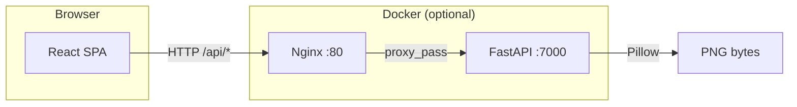
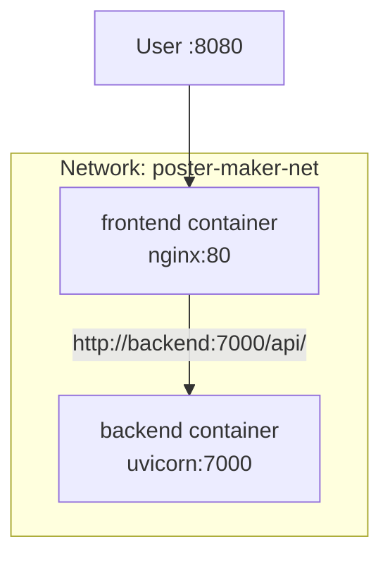
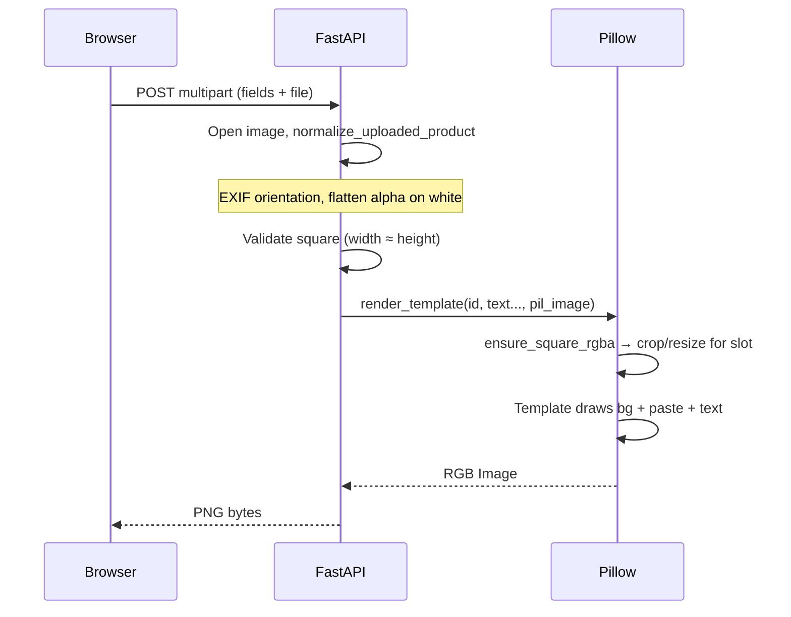
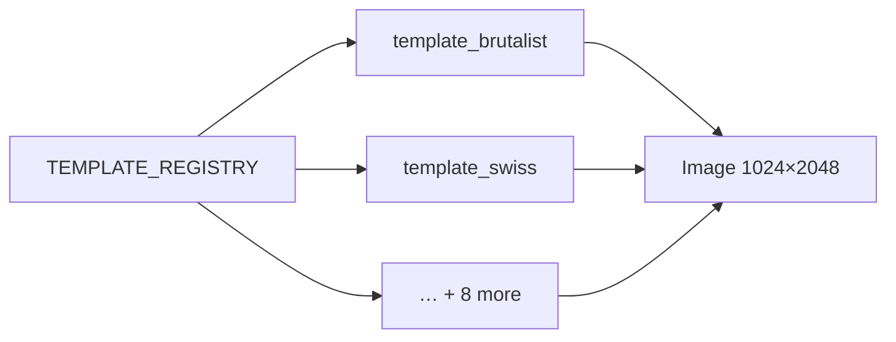
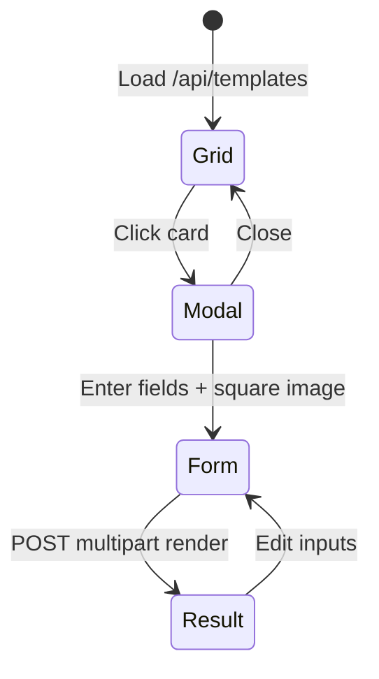
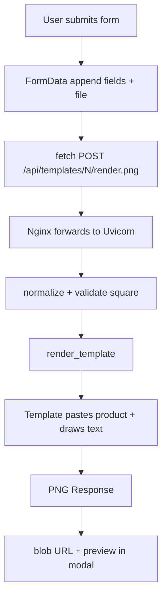

# Poster Maker — Project Guide

This document explains how the **Poster Maker** app is structured, how data flows through it, and how the pieces fit together. Read it top to bottom for a full picture, or jump to the sections you care about.

---

## 1. What the app does

1. Shows **10 poster templates** as a grid (3 columns in the main panel).
2. Each template is a **1024×2048 px** vertical layout generated on the server with **Pillow**.
3. The user picks a template, opens a **modal**, uploads a **square product image**, and enters **name**, **short description**, and **price**.
4. The server **composites** that content into the chosen template and returns a **PNG** the user can download.

Previews on the grid use **fixed dummy text** and a **built-in placeholder** image so every card looks consistent before you customize.

---

## 2. High-level architecture



- **Frontend:** React + Vite. In production it is static files served by **Nginx**, which also **reverse-proxies** `/api/` to the backend.
- **Backend:** **FastAPI** + **Uvicorn** on port **7000** inside the container (not exposed directly in the default compose file; only the frontend port **8080** is published).



---

## 3. Repository layout

```
poster-maker/
├── docker-compose.yml      # frontend + backend on shared bridge network
├── README.md               # Quick start (build, run, ports)
├── PROJECT.md              # This file
├── backend/
│   ├── Dockerfile
│   ├── requirements.txt
│   └── app/
│       ├── main.py              # HTTP routes, upload handling
│       ├── poster_templates.py  # 10 template functions + registry
│       └── render_utils.py      # fonts, text wrap, square crop, image normalize
└── frontend/
    ├── Dockerfile              # multi-stage: npm build → nginx
    ├── nginx.conf              # SPA + /api proxy + upload size limit
    ├── vite.config.ts          # dev proxy to localhost:7000
    └── src/
        ├── App.tsx             # UI, modal, form, fetch calls
        ├── App.css             # layout 32/68, grid, animations
        └── index.css           # global reset, body, #root
```

---

## 4. Backend: routes and responsibilities

| Method | Path | Purpose |
|--------|------|---------|
| `GET` | `/api/health` | Liveness check |
| `GET` | `/api/templates` | JSON list: `{ id, title, blurb }` for each template |
| `GET` | `/api/templates/{id}/preview.png` | PNG preview (dummy copy + placeholder image) |
| `POST` | `/api/templates/{id}/render.png` | **Multipart form**: `product_name`, `product_description`, `price`, `product_image` → final PNG |

### Image pipeline (upload → poster)



**Why flatten transparency?** PNGs with transparent areas become **black** when naively converted to RGB. The app composites uploads onto **white** first so outlines and soft edges look correct on light templates.

**Limits:** description max **180** characters, name **80**, price **32**, file max **8 MB**. Nginx allows **10 MB** body for uploads.

---

## 5. Template system

All templates live in **`backend/app/poster_templates.py`**.

- **`TEMPLATE_REGISTRY`**: maps string IDs `"1"`…`"10"` to `(display title, blurb, function)`.
- Each function has the same signature:  
  `(name: str, description: str, price: str, product: Image.Image) -> Image.Image`
- Shared helpers in **`render_utils.py`**:
  - **`POSTER_W`, `POSTER_H`**: 1024×2048
  - **`ensure_square_rgba`**: center-crop to square, resize to template slot size
  - **`load_font`**: DejaVu fonts (installed in Docker image)
  - **`wrap_text`**: simple word wrap for descriptions
  - **`normalize_uploaded_product`**: EXIF + alpha on white



To add a template: implement a new function, register it in **`TEMPLATE_REGISTRY`**, and restart the API.

---

## 6. Frontend: screens and flow



- **Left column (32%)**: marketing copy, bullet list, footer.
- **Right column (68%)**: scrollable grid of preview thumbnails (``).
- **Modal**: form with file input (client-side square check ~2% tolerance), name, description, price; then result view with **Download poster** and **Edit inputs**.

**Dev vs prod**

- **Dev:** `npm run dev` (Vite) proxies `/api` to `http://127.0.0.1:7000`.
- **Prod (Docker):** browser hits **only** `http://localhost:8080`; Nginx serves JS/CSS and forwards `/api/*` to the backend service name **`backend`**.

---

## 7. Docker Compose (how containers talk)

```yaml
# Simplified idea
services:
  backend:   # hostname "backend" on poster-net, listens :7000
  frontend:  # publishes 8080:80, proxies /api → backend:7000
networks:
  poster-net: name poster-maker-net
```

Build and run (from repo root):

```bash
docker compose up --build -d
```

Open **http://localhost:8080**.

---

## 8. Configuration touchpoints

| Concern | Where |
|--------|--------|
| API port in container | `backend/Dockerfile` (`uvicorn --port 7000`) |
| Nginx → API upstream | `frontend/nginx.conf` (`proxy_pass http://backend:7000/api/`) |
| Max upload through proxy | `frontend/nginx.conf` (`client_max_body_size 10M`) |
| Vite dev API proxy | `frontend/vite.config.ts` |
| CORS | `backend/app/main.py` (permissive `*` for simplicity) |

---

## 9. Tech stack summary

| Layer | Technology |
|-------|------------|
| UI | React 18, TypeScript, Vite |
| Styling | Plain CSS (layout, grid, animations, `prefers-reduced-motion`) |
| API | FastAPI, Pydantic (minimal; forms use `Form`/`File`) |
| Images | Pillow |
| Containers | Python 3.12-slim, Node Alpine build + Nginx Alpine |

---

## 10. Extending the project

- **New template:** add function + registry entry in `poster_templates.py`.
- **New form field:** add `Form(...)` in `main.py`, pass into `render_template` / template functions, mirror field in `App.tsx` and `FormData`.
- **Stricter images:** tighten `SQUARE_ASPECT_TOLERANCE` in `render_utils.py` and the frontend `SQUARE_TOLERANCE` constant in `App.tsx`.

---

## 11. Diagram: one request end-to-end (render)



---

This should be enough to onboard yourself (or someone else) onto the codebase: where things live, how traffic moves, and how a template turns into a downloadable poster.
